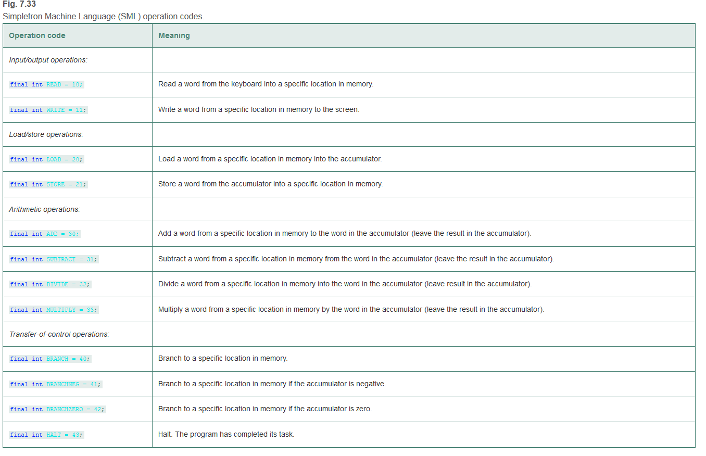
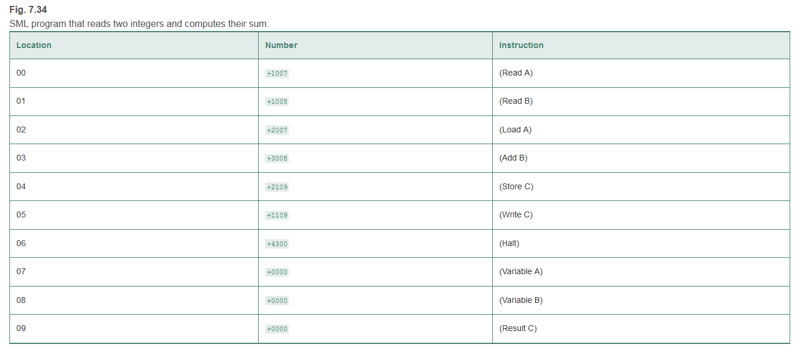
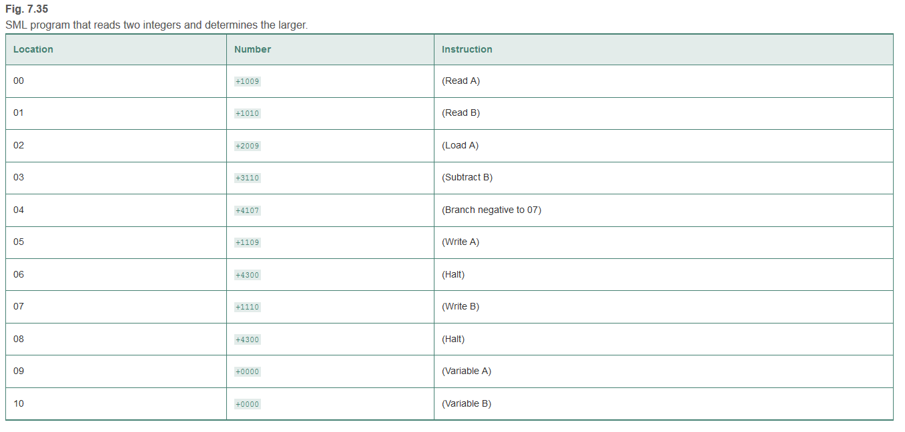
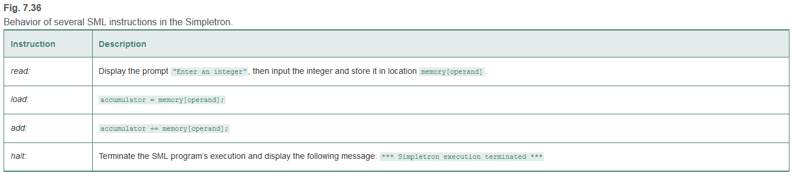
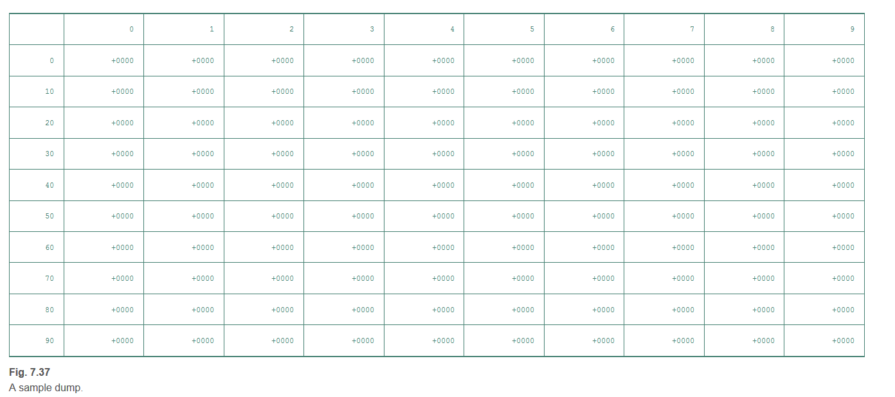

## 7.36 (Machine-Language Programming)
Let’s create a computer called the Simpletron. As its name implies, it’s a simple machine, but powerful. 
The Simpletron runs programs written in the only language it directly understands: Simpletron Machine Language (SML). 
The Simpletron contains an accumulator—a special register in which information is put before the Simpletron uses that information in calculations or examines it in various ways. 
All the information in the Simpletron is handled in terms of words. A word is a signed four-digit decimal number, such as +3364, -1293, +0007 and -0001. The Simpletron is equipped with a 100-word memory, and these words are referenced by their location numbers 00, 01, …, 99. Before running an SML program, we must load, or place, the program into memory. The first instruction (or statement) of every SML program is always placed in location 00. The simulator will start executing at this location. Each instruction written in SML occupies one word of the Simpletron’s memory (so instructions are signed four-digit decimal numbers). We shall assume that the sign of an SML instruction is always plus, but the sign of a data word may be either plus or minus. Each location in the Simpletron’s memory may contain an instruction, a data value used by a program or an unused (and so undefined) area of memory. 
The first two digits of each SML instruction are the operation code specifying the operation to be performed. SML operation codes are summarized in 



The last two digits of an SML instruction are the operand—the address of the memory location containing the word to which the operation applies. 
Let’s consider several simple SML programs. The first SML program (Fig. 7.34 ) reads two numbers from the keyboard and computes and displays their sum. 
The instruction +1007 reads the first number from the keyboard and places it into location 07 (which has been initialized to 0). 
Then instruction +1008 reads the next number into location 08. The load instruction, +2007, puts the first number into the accumulator, and the add instruction, +3008, adds the second number to the number in the accumulator. All SML arithmetic instructions leave their results in the accumulator. The store instruction, +2109, places the result back into memory location 09, from which the write instruction, +1109, takes the number and displays it (as a signed four-digit decimal number). The halt instruction, +4300, terminates execution.



The second SML program (Fig. 7.35 ) reads two numbers from the keyboard and determines and displays the larger value. Note the use of the instruction +4107 as a conditional transfer of control, much the same as Java’s if statement.



Now write SML programs to accomplish each of the following tasks:
1.Use a sentinel-controlled loop to read 10 positive numbers. Compute and display their sum.
2.Use a counter-controlled loop to read seven numbers, some positive and some negative, and compute and display their average.
3.Read a series of numbers, and determine and display the largest number. The first number read indicates how many numbers should be processed.

## 7.37 (Computer Simulator)
In this problem, you’re going to build your own computer. No, you’ll not be soldering components together. Rather, you’ll use the powerful technique of software-based simulation to create an object-oriented software model of the Simpletron of Exercise 7.36 . Your Simpletron simulator will turn the computer you’re using into a Simpletron, and you’ll actually be able to run, test and debug the SML programs you wrote in Exercise 7.36 .

When you run your Simpletron simulator, it should begin by displaying:
```
*** Welcome to Simpletron! ***
*** Please enter your program one instruction    ***
*** (or data word) at a time. I will display     ***
*** the location number and a question mark (?). ***
*** You then type the word for that location.    ***
*** Type -99999 to stop entering your program.   ***
```

Your application should simulate the memory of the Simpletron with a one-dimensional array memory that has 100 elements. Now assume that the simulator is running, and let’s examine the dialog as we enter the program of Fig. 7.35 (Exercise 7.36 ):
```
00 ? +1009
01 ? +1010
02 ? +2009
03 ? +3110
04 ? +4107
05 ? +1109
06 ? +4300
07 ? +1110
08 ? +4300
09 ? +0000
10 ? +0000
11 ? -99999
```

Your program should display the memory location followed by a question mark. Each value to the right of a question mark is input by the user. When the sentinel value -99999 is input, the program should display the following:
```
*** Program loading completed ***
*** Program execution begins  ***
```

The SML program has now been placed (or loaded) in array memory. Now the Simpletron executes the SML program. Execution begins with the instruction in location 00 and, as in Java, continues sequentially, unless directed to some other part of the program by a transfer of control.

Use the variable accumulator to represent the accumulator register. Use the variable instructionCounter to keep track of the location in memory that contains the instruction being performed. Use the variable operationCode to indicate the operation currently being performed (i.e., the left two digits of the instruction word). Use the variable operand to indicate the memory location on which the current instruction operates. Thus, operand is the rightmost two digits of the instruction currently being performed. Do not execute instructions directly from memory. Rather, transfer the next instruction to be performed from memory to a variable called instructionRegister. Then pick off the left two digits and place them in operationCode, and pick off the right two digits and place them in operand. When the Simpletron begins execution, the special registers are all initialized to zero.

Now, let’s walk through execution of the first SML instruction, +1009 in memory location 00. This procedure is called an instruction-execution cycle.

The instructionCounter tells us the location of the next instruction to be performed. We fetch the contents of that location from memory by using the Java statement
```
instructionRegister = memory[instructionCounter];
```

The operation code and the operand are extracted from the instruction register by the statements
```
operationCode = instructionRegister / 100;
operand = instructionRegister % 100;
```
Now the Simpletron must determine that the operation code is actually a read (versus a write, a load, and so on). A switch differentiates among the 12 operations of SML. In the switch statement, the behavior of various SML instructions is simulated as shown in Fig. 7.36 . We discuss branch instructions shortly and leave the others to you.



When the SML program completes execution, the name and contents of each register as well as the complete contents of memory should be displayed. Such a printout is often called a computer dump (no, a computer dump is not a place where old computers go). To help you program your dump method, a sample dump format is shown in Fig. 7.37 . A dump after executing a Simpletron program would show the actual values of instructions and data values at the moment execution terminated.
```
REGISTERS:
accumulator          +0000
instructionCounter      00
instructionRegister  +0000
operationCode           00
operand                 00

MEMORY:
```



Let’s proceed with the execution of our program’s first instruction—namely, the +1009 in location 00. As we’ve indicated, the switch statement simulates this task by prompting the user to enter a value, reading the value and storing it in memory location memory[operand]. The value is then read into location 09.

At this point, simulation of the first instruction is completed. All that remains is to prepare the Simpletron to execute the next instruction. Since the instruction just performed was not a transfer of control, we need merely increment the instruction-counter register as follows:
```
instructionCounter++;
```
This action completes the simulated execution of the first instruction. The entire process (i.e., the instruction-execution cycle) begins anew with the fetch of the next instruction to execute.

Now let’s consider how the branching instructions—the transfers of control—are simulated. All we need to do is adjust the value in the instruction counter appropriately. Therefore, the unconditional branch instruction (40) is simulated within the switch as
```
instructionCounter = operand;
```
The conditional “branch if accumulator is zero” instruction is simulated as
```
if (accumulator == 0) { instructionCounter = operand; }
```
At this point, you should implement your Simpletron simulator and run each of the SML programs you wrote in Exercise 7.36 . If you desire, you may embellish SML with additional features and provide for these features in your simulator.

Your simulator should check for various types of errors. During the program-loading phase, for example, each number the user types into the Simpletron’s memory must be in the range -9999 to +9999. Your simulator should test that each number entered is in this range and, if not, keep prompting the user to re-enter the number until the user enters a correct number.

During the execution phase, your simulator should check for various serious errors, such as attempts to divide by zero, attempts to execute invalid operation codes, and accumulator overflows (i.e., arithmetic operations resulting in values larger than +9999 or smaller than -9999). Such serious errors are called fatal errors. When a fatal error is detected, your simulator should display an error message, such as
```
*** Attempt to divide by zero ***
*** Simpletron execution abnormally terminated ***
```# Assignment2-1
